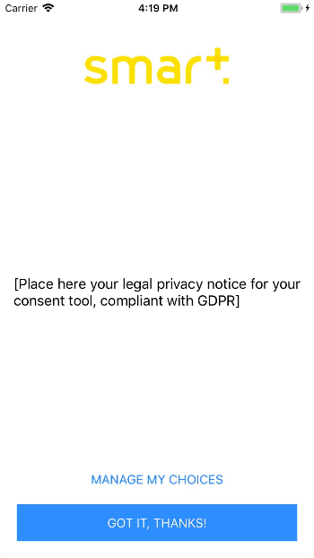

# SmartCMP for iOS

## Introduction

_SmartCMP for iOS_ is a iOS framework allowing you to retrieve and store the user's consent for data usage in your iOS apps.

The purposes & vendors retrieval as well as the consent storage is compliant with [IAB Transparency and Consent Framework specifications](https://github.com/InteractiveAdvertisingBureau/GDPR-Transparency-and-Consent-Framework).

Retrieving user consent is mandatory in EU starting May 25th due to the _General Data Protection Regulation (GDPR)_.

<p align="center">
  
</p>

## Usage

### Installation

Drag the ```SmartCMP.xcodeproj``` to your project and add the ```SmartCMP.framework``` target to the _Embedded Binaries_ section of your project _General_ properties.

### Integration

You must setup the CMP before using it. Start by creating a configuration object that will define how the first screen of the consent tool will look like:

    let config = CMPConsentToolConfiguration(logo: UIImage(named: "logo")!,
                                           homeScreenText: "[Place here your legal privacy notice for the consent tool, compliant with GDPR]",
                                           homeScreenManageConsentButtonTitle: "MANAGE MY CHOICES",
                                           homeScreenCloseButtonTitle: "GOT IT, THANKS!",
                                           consentManagementScreenTitle: "Privacy preferences",
                                           consentManagementCancelButtonTitle: "Cancel",
                                           consentManagementSaveButtonTitle: "Save",
                                           consentManagementScreenVendorsSectionHeaderText: "Vendors",
                                           consentManagementScreenPurposeSectionHeaderText: "Purpose",
                                           consentManagementVendorsControllerAccessText: "Authorized vendors",
                                           consentManagementActivatedText: "yes",
                                           consentManagementDeactivatedText: "no",
                                           consentManagementPurposeDetailAllowText: "Allowed",
                                           consentManagementVendorDetailViewPolicyText: "View privacy policy",
                                           consentManagementVendorDetailPurposesText: "Required purposes",
                                           consentManagementVendorDetailLegitimatePurposesText: "Legitimate interest purposes",
                                           consentManagementVendorDetailFeaturesText: "Features")

Call the ```configure()``` method on ```CMPConsentManager.shared``` to start the CMP.

    CMPConsentManager.shared.configure(language: CMPLanguage.DEFAULT_LANGUAGE, consentToolConfiguration: self.generateConsentToolConfiguration())

When the CMP is started, it will automatically fetch the most recent vendors list _(vendors.json)_ and prompt the user for consent if necessary, saving the resulting consent string in iOS _NSUserDefaults_ (according to the IAB specifications).

You might want to control when the user will be prompted for consent for better user experience. In this case, define a delegate for ```CMPConsentManager.shared```:

    CMPConsentManager.shared.delegate = self

When retrieval of the user consent is required, the ```consentManagerRequestsToShowConsentTool```
 method will be called on the delegate and it will be the app's responsability to display the consent tool UI when appropriate.

    func consentManagerRequestsToShowConsentTool(_ consentManager: CMPConsentManager, forVendorList vendorList: CMPVendorList) {
      // It is necessary to update the user consent using the consent tool or your own UI
    }

Showing the consent tool is done using the method ```showConsentTool```. Note that this method can be used not only when it has been requested by the consent manager, but also anytime you want to provide a way for the user to change its consent options.

    CMPConsentManager.shared.showConsentTool(fromController: self)

## 'Limited Ad Tracking' behavior

On iOS, the user can opt out for any tracking related to advertisement by enabling 'Limited Ad Tracking' in the OS settings. By default, the CMP does not handle this option and let the app developer choose how he wants to proceed if it has been enabled by the user. **Please note that not handling the 'Limited Ad Tracking' option properly is a violation of Apple App Store's terms & conditions. Your app might be removed from the store.**

However, if you configure the CMP with the parameter ```showConsentToolWhenLimitedAdTracking``` set to _false_, it will handle the 'Limited Ad Tracking' option automatically. In case of limited ad tracking the CMP will not display the consent tool and will not call the delegate, but will instead store a consent string with no consent given for any purposes or vendors.

## Known limitations

The current version of _SmartCMP_ has the following limitations:

* The consent tool UI is not customizable (except for static texts). You can however build your own UI and display it in the ```consentManagerRequestsToShowConsentTool``` delegate method using the ```vendorList``` parameter.
* _AppleTV_ apps are not supported.
* The IAB specification allows publishers to display only a subset of purposes & vendors using a _pubvendors.json_ file, stored on their own infrastructure. _SmartCMP_ does not implement this feature at this time.
* No static texts are provided by default (you must provide them to ```CMPConsentToolConfiguration```). The ```homeScreenText``` should be validated by your legal department.

## License

### Code source licensing

This software is distributed under the _Creative Commons Legal Code, Attribution 3.0 Unported_ license.

Check the [LICENSE file](LICENSE) for more details.

### Reusing SmartCMP ID

The CMP ID _'33'_ used for consent string encoding is the CMP ID of _Smart AdServer_.

You can use this CMP ID as long as you don't alter the source code of _SmartCMP_. If you do modify the source code, **YOU MUST REGISTER YOUR FORK AS A NEW CMP and change the CMP ID** in ```CMPConstants.CMPInfos.ID```. You can register your fork CMP and obtain your own ID here: https://register.consensu.org/CMP
